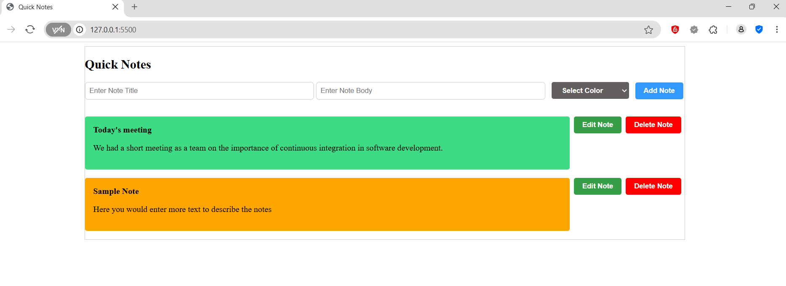

# Quick Notes

Quick Notes is a lightweight web application that allows users to quickly add, edit, and delete notes. The app also provides the ability to assign colors to notes for better organization and visual clarity. This project demonstrates basic DOM manipulation, event handling, and local data management using JavaScript.

## Features
- **Add Notes:** Enter a title, body, and select a background color for your notes.
- **Edit Notes:** Modify the content of existing notes.
- **Delete Notes:** Remove notes with a single click.
- **Customizable Colors:** Assign colors from a predefined palette to differentiate notes visually.
- **Real-Time Updates:** Changes to notes are immediately reflected on the UI.

## Technologies Used
- **HTML5:** Structure of the application.
- **CSS3:** Basic styling for the application.
- **JavaScript:** Core logic for creating, editing, and deleting notes.

## Screenshots
### Main Interface:


## Getting Started

### Prerequisites
To run this project, all you need is a modern web browser like Chrome, Firefox, or Edge.

### Installation
1. Clone the repository:
   ```bash
   git clone https://github.com/DDTraining/quick-notes.git
   ```


2. Navigate to the project directory
    ```bash
    cd quick-notes
    ```
3. Open `index.html` in your browser.

    #### Usage

    #### Adding a Note:
    1. Enter a title in the "Enter Note Title" input field.
    2. Enter the note body in the "Enter Note Body" input field.
    3. Select a background color from the dropdown menu.
    4. Click the "Add Note" button to add the note to the list.
    
    #### Editing a Note:

    1. Click the "Edit Note" button on the desired note.
    2. Modify the title and/or body directly in the note.
    3. Click "Save Note" to update the changes, or "Cancel Edit" to revert.


    #### Deleting a Note:

    1. Click the "Delete Note" button on the note you want to remove.


## Project Structure
```graphql
quick-notes/
│
├── index.html       # Main HTML file
├── styles.css       # CSS file for styling
├── index.js         # JavaScript file for application logic
└── README.md        # Project documentation
```


## Future Enhancements
**Persistent Storage**: Save notes in local storage or integrate with a database.

**Search Functionality**: Add a search bar to filter notes by title or content.

**Color Picker**: Allow users to select custom colors instead of predefined options.

**Drag and Drop**: Enable reordering of notes using drag-and-drop functionality.

## Contributing
Contributions are welcome! Please follow these steps:

1. Fork the repository.
2. Create a feature branch: `git checkout -b feature-name`.
3. Commit your changes: `git commit -m "Add feature description"`.
4. Push to the branch: `git push origin feature-name`.
5. Open a pull request.